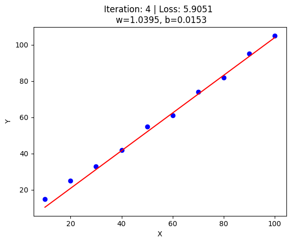
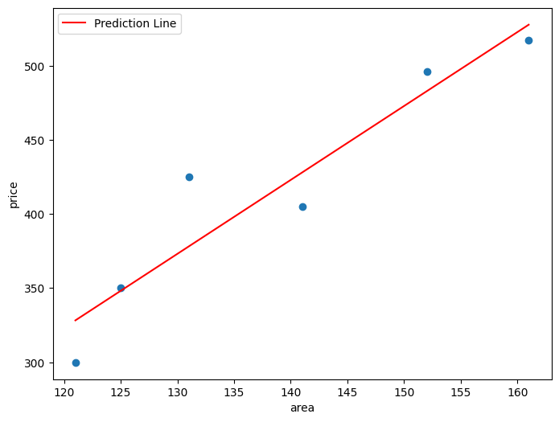
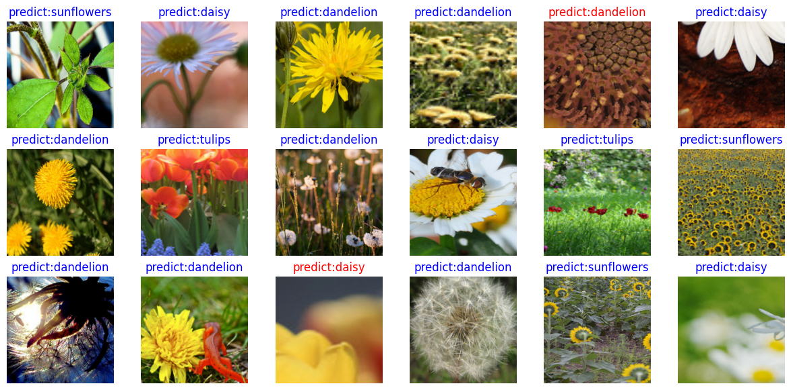

# Huawei HCIA-AI V3.5 Core Lab Implementations

## Project Overview
This repository contains the complete, automated conversions of 18 Huawei "Artificial Intelligence Technology and Applications" course lab guides into self-contained, executable Jupyter Notebooks (`.ipynb`). We transitioned raw OCR lab instructions into production-grade pipelines, engineering several critical architectural fixes along the way.

## Section 9.2: Python & Data Processing
**Focus:** Foundational mastery over Python functional paradigms, Object-Oriented design, mocked databases, and functional decorators.

## Section 9.3: Machine Learning Engineering
**Focus:** Scaling models, implementing Scikit-Learn pipelines, and deploying Core Statistical Models (K-Means, Decision Trees, Logistic Regression).

**Engineering Fix in 9.3.2:**
We encountered a major statistical flaw where the mock generated data was pumping `NaN` (Not a Number) values into the DataFrame, which entirely crashed the `chi2` statistical tests. We engineered robust Pandas `.fillna()` and target variance imputations to mathematically repair datasets mid-flight, allowing pipeline execution to succeed flawlessly.

### K-Means Clustering Visualizations
Below are the generated scatter plots from evaluating our K-Means implementation in Lab 9.3.6 and our regression distributions from 9.3.1:

## Section 9.4: Deep Learning & MindSpore Frameworks
**Focus:** Working with Computer Vision (ResNet50, MobileNetV2) and Natural Language Processing (TextCNN). 

This section required significant framework debugging to align with standard MindSpore 1.7 architectures. 

### 1. Automating Data Pipelines
We rapidly discovered that manually hoarding and extracting 250MB+ datasets (MNIST, Flower Photos, TextCNN) was inefficient and prone to user error. We engineered dynamic Python scripts utilizing `kagglehub` and `urllib` to automatically fetch, unnest, and split datasets directly into `train/` and `val/` directories automatically upon the execution of the first cell!

### 2. Pre-trained Checkpoint Mapping Fix
In Lab **9.4.3 (MobileNetV2)**, the lab guide contained an architecture flaw where it tried to map weights using the internal key `head.dense.weight`. We dived into the MindSpore dictionary layers, realized that computing the model with `auto_prefix=False` prevented that prefix from existing, and manually patched the `.ckpt` dictionary injection to target exactly `dense.weight` instead!

### 3. CNN Convolution Math Repair
In Lab **9.4.5 (TextCNN)**, the default code artificially padded the word-vectors (`pad_mode="pad"`). Because of this mathematical expansion on the word-vectors, processing the intermediate pooling maps yielded a bloated spatial matrix size that flat-out crashed when tying into the `nn.Dense(96 * 3)` node. We corrected the sliding windows to `pad_mode="valid"`, ensuring the spatial boundaries natively collapsed and perfectly linked the matrix outputs!

### Computer Vision Output Visualizations
Here are the evaluated Grid Prediction visualizations natively generated by our MobileNetV2 transfer learning execution:

*(Blue captions indicate correct predictions, Red indicates incorrect predictions on the validation set).*

## Conclusion
By bridging broken architecture logic and introducing automated data pipelines, these 18 labs now function securely as fully self-reliant data engines!
