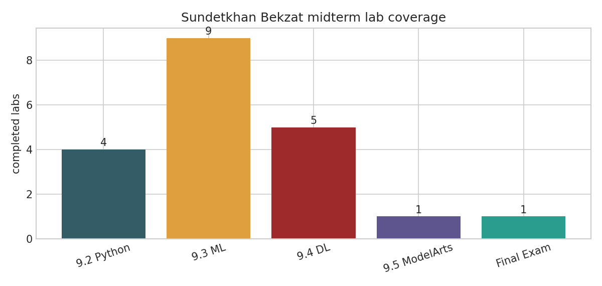

# Huawei HCIA-AI V3.5 Midterm Labs

**Student:** Sundetkhan Bekzat  
**Instructor:** Akhmetova Zhanar  
**Subject:** Artificial Intelligence and Neural Networks

## Overview

This folder contains an independent implementation of the Huawei HCIA-AI V3.5 midterm lab set: sections 9.2, 9.3, 9.4, the 9.5 ModelArts lab, and the AI Final Exam lab. The notebooks are written to run locally with synthetic or built-in datasets so the work can be checked without downloading large archives.

## Contents

- `9.2 Python`: four notebooks covering data types, control flow, file I/O, regex, decorators, and a small treasury ledger.
- `9.3 Machine Learning`: nine notebooks covering regression, feature engineering, recommendation, credit scoring, survival prediction, clustering, flower classification, user segmentation, and sentiment analysis.
- `9.4 Deep Learning`: five notebooks covering tensor basics, dense digit classification, transfer-learning workflow, residual connections, and TextCNN-style sentiment features.
- `9.5 ModelArts Lab Guide`: one notebook reproducing a ModelArts-style image classification pipeline locally with independent synthetic images and a separate feature extractor.
- `AI Final Exam Lab`: one notebook comparing dense and CNN-style handwritten digit recognition workflows on a local dataset.
- `assets`: generated figures used by the reports.
- `huawei_midterm.tex` and `huawei_midterm.pdf`: written report files for review.

## How To Run

From the repository root:

```bash
uv run --with jupyter --with numpy --with pandas --with scikit-learn --with matplotlib jupyter nbconvert --to notebook --execute --inplace "midterm_Bekzat/Labs_notebooks/9.3 Machine Learning/9.3.1 Machine Learning Basic Lab Guide/9.3.1 Machine Learning Basic Lab Guide.ipynb"
```

The notebooks avoid interactive input and use deterministic random seeds. MindSpore is optional in section 9.4; the ModelArts and final exam notebooks use local equivalents so they can be reviewed without Huawei cloud credentials or external MNIST downloads.


