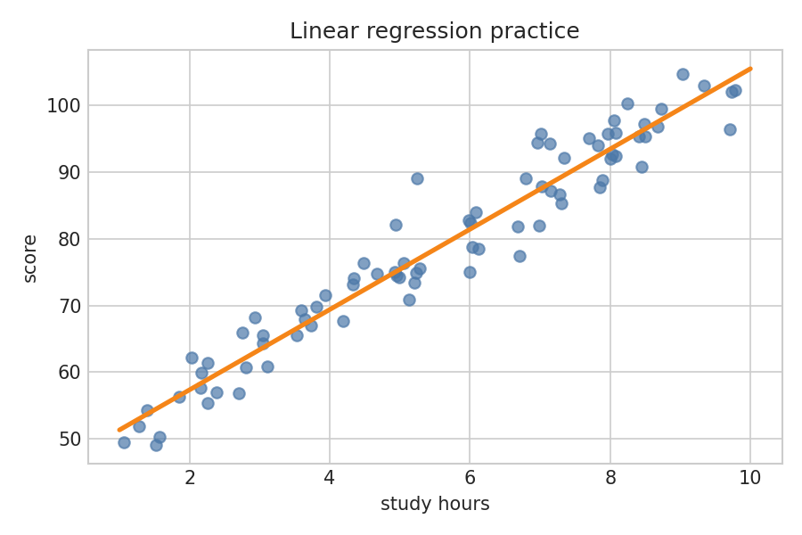
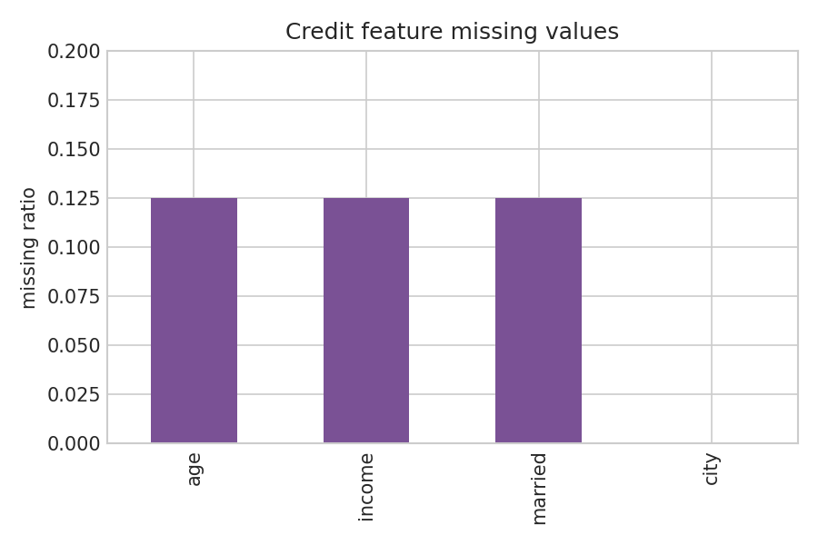
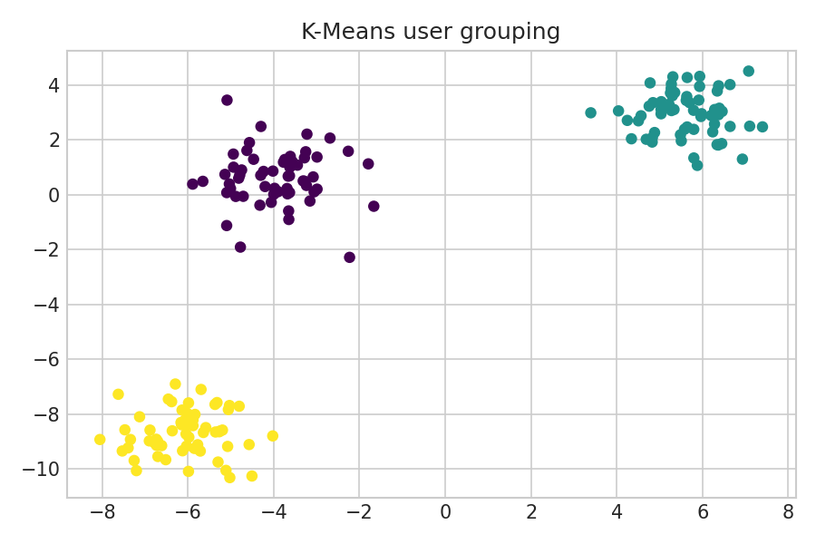
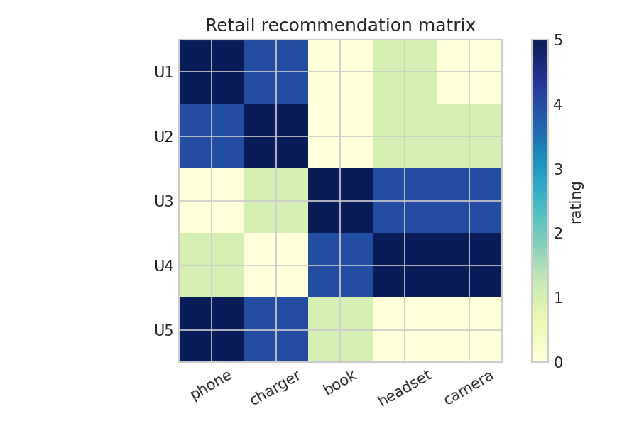

# Section 9.3: Machine Learning Practice

**Student:** Sundetkhan Bekzat

## Purpose

Section 9.3 moves from programming exercises into classical machine learning. The notebooks use NumPy, Pandas, Matplotlib, and scikit-learn to demonstrate preprocessing, model fitting, evaluation, and visualization.

## Main Work

- Regression and classification baselines are implemented with train/test splits and metrics.
- Missing credit features are repaired with median imputation before chi-square and wrapper-based selection.
- Recommendation is demonstrated through user-item similarity and SVD factors.
- Credit default prediction includes class weighting and threshold tuning.
- Titanic, flower, e-commerce, and customer-review tasks use compact local datasets or synthetic data.

## Visual Evidence

## Result

All machine learning notebooks are deterministic and small enough for local execution. They keep the same lab objectives while using independent variable names, data construction, and explanations.
