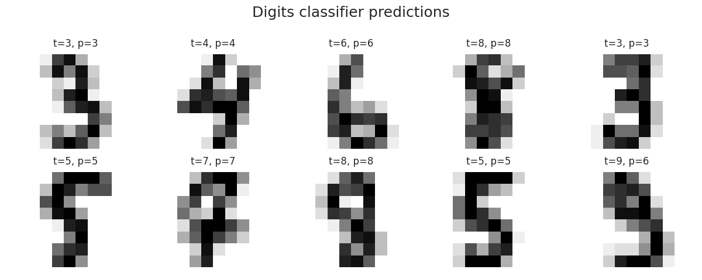
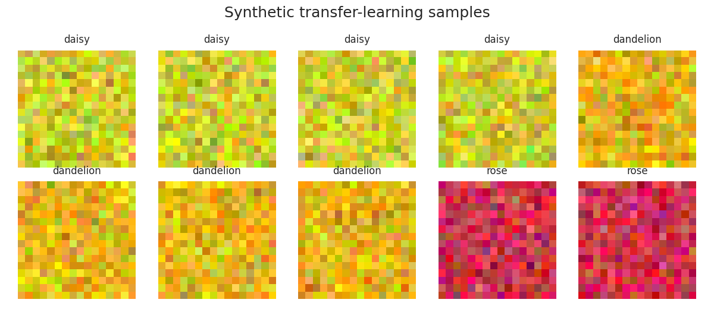
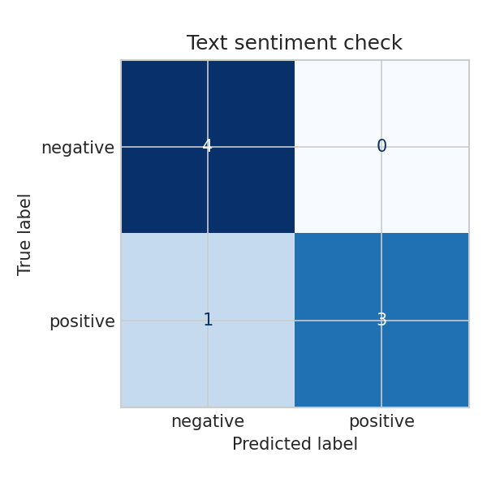

# Section 9.4: Deep Learning and AI Framework Concepts

**Student:** Sundetkhan Bekzat

## Purpose

Section 9.4 covers the deep learning part of the midterm. Because large MindSpore datasets and checkpoints are not guaranteed to be available locally, the notebooks are designed with executable fallbacks that preserve the architectural ideas.

## Completed Topics

- Tensor and batching concepts with optional MindSpore detection.
- Dense handwritten-digit classification using the built-in digits dataset.
- Transfer-learning workflow using synthetic image tensors and a frozen feature extractor.
- Residual block shape alignment and checkpoint-like parameter inspection.
- TextCNN-style sentiment analysis using n-gram pooling and a dense classification head.

## Visual Evidence

## Result

The notebooks are runnable without network downloads and still show the key engineering concerns of deep learning labs: tensor shapes, feature extraction, classification heads, residual paths, and text feature pooling.
