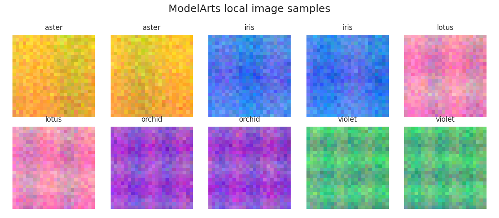
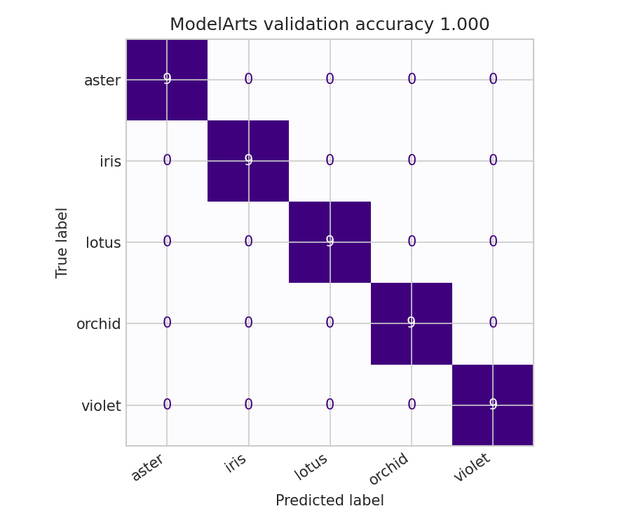

# Section 9.5: ModelArts Local Image Classification

**Student:** Sundetkhan Bekzat

## Purpose

Section 9.5 reproduces the idea of Huawei ModelArts ExeML image classification without requiring cloud access. The notebook creates an independent synthetic image dataset, validates class balance, extracts local image descriptors, trains a classifier, and checks endpoint-style predictions.

## Main Work

- Built a local image workspace with five flower-like categories using generated color and texture patterns.
- Implemented a feature extraction service based on channel statistics, edge strength, and quadrant differences.
- Trained a Random Forest classifier as a compact ExeML-style image classification job.
- Evaluated the model with a confusion matrix and a simulated endpoint prediction batch.

## Visual Evidence

## Result

The notebook follows the same ModelArts workflow idea while using different variable names, helper functions, synthetic data, and local execution logic. It is not a direct copy of the reference folder.
