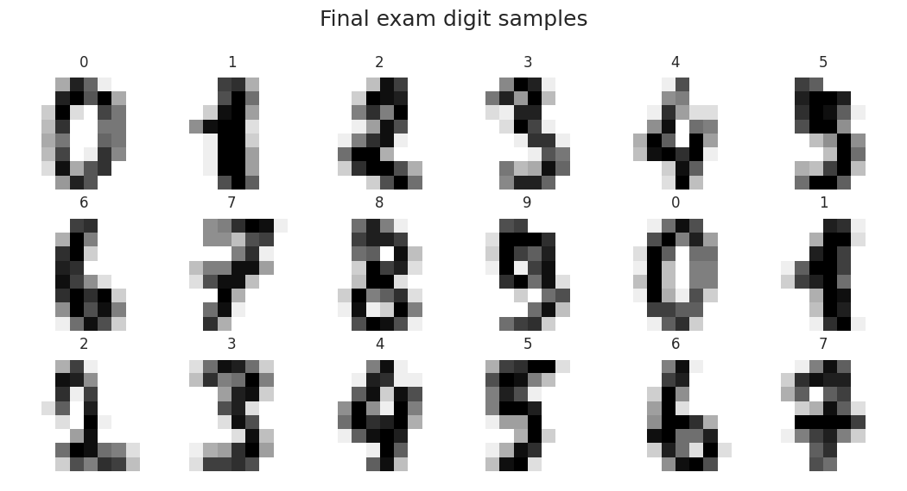
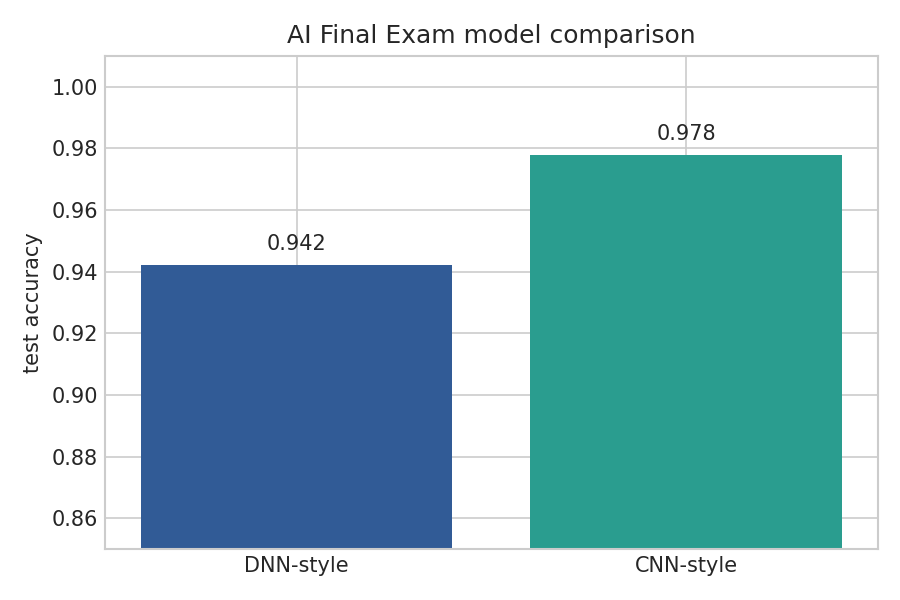

# AI Final Exam Lab: Handwritten Digit Recognition

**Student:** Sundetkhan Bekzat

## Purpose

The final exam notebook demonstrates handwritten digit recognition with two model styles. Instead of copying the TensorFlow/MNIST implementation from the other folder, this version uses the built-in digits dataset and compares a dense neural network with a CNN-style spatial feature model.

## Main Work

- Loaded a local handwritten digit dataset and prepared a stratified train/test split.
- Visualized digit samples to confirm the input image structure.
- Trained a dense MLP classifier on scaled flattened pixels.
- Built a CNN-style spatial descriptor from local edges, quadrants, and center mass before classification.
- Compared test accuracy and inspected prediction behavior through a confusion matrix and deployment-style grid.

## Visual Evidence

## Result

The notebook covers the final exam objective with independent preprocessing names, model variables, feature functions, and plotting logic. It remains fast and reproducible on a local machine.
